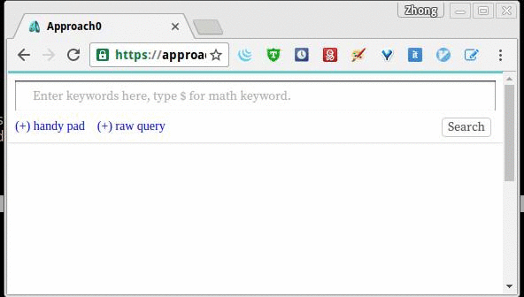
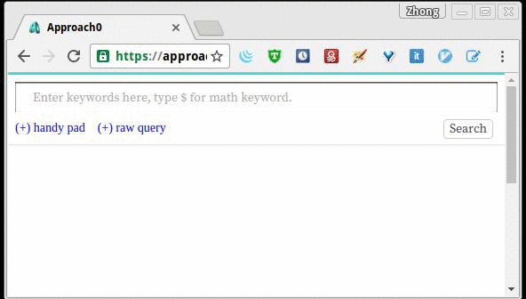

## Guide for New Users
[Approach Zero](https://approach0.xyz) is a *math-aware search engine*.
This page aims to give new users a quick tour about how to use this search engine.

#### What is math-aware search?
“Math-aware” means you can add math expression(s) as some of your keywords to have search engine help you find similar expressions and return those documents that you may find relevant to your query. In short, a typical search engine plus math search.

#### What the search engine actually looks for?
The current index includes [Mathematics StackExchange](http://math.stackexchange.com) and [ArtOfProblemSolving](https://artofproblemsolving.com/community). The dataset has around two million documents with tens of millions of math formulas.

#### How a query is entered?

##### 1. Non-math keywords
If you only want to search normal text, just type the keyword(s) like what you normally do on a typical search engine:


(When you have entered one keyword, hit `Enter` to finish editing, then you need to hit `Enter` again or click search button to perform search)

##### 2. Math keyword
To input math keyword is also very intuitive, user does not
have to know TeX to input a math expression on search box.
Below is an example of inputting math expression \\(\log(x)\\):


One can either type `\log(x)` or `log(x)` directly on search
box to input \\(\log(x)\\). Although this would work, the
recommended way is first to type a dollar sign `$` (to indicate
the next keyword you are entering is a math keyword) followed
by your math expression.

This is important to clarify your query intention when you are entering a math expression
which is somewhat hard to tell by the system whether it is a math expression or text words.
(e.g. `AI` can be interpreted as a matrix multiplication in
math or acronym for "Artificial Intelligence" in English)

##### 3. Mixed keywords
One can mix non-math and math keywords together (in any order)
within one query:


One restriction: You are limited to enter no more than 2 math
formula keywords and no more than 10 text keywords per query.

#### Other tips
* If there are some math symbols that you do not know how to type,
use `Lookup symbols` under search query box to try some luck.

* We support copy-paste in query input box. For math keyword,
paste a/b and $a/b$ into query box both result in the same
math expression \\(\dfrac a b \\). The latter is more recommended
because it is more explicit and less dependent on guessing the type
of the query based on some indicator symbols (such as `/` sign here).

* If you do not get any search result (when you see "No hit found") or when you see the query box has a
red-colored box around your inputting math formula, it indicates that you may have
typed a malformed math formula. In this case, double check your **raw** query by clicking the `raw query` link
under search box.

	Some typical malformed examples:
	* `a^(1+2+3)` should be `a^{1+2+3}`
	* `sin(x)` should be `\sin(x)`
	* `$lim$` should be `$\lim$` or  `\lim` in raw query, again, remember to add backslash for math command in TeX!
	* `$ f\left(x\right)\le1\ and\ f'\left(x\right)\le1 $` is also a bad query, never mix text and math in a single keyword, if you really want to do so, surround text in `\text{}` command. 

	If you still do not get any results, try to reduce the complexity of your math formula(s), and only use what you think  is the most representing parts from it for searching.

* How to enter integrals lower and upper bounds using query box editor?
	* It can be a little tricky if you are unfamiliar with the query editor:
	
	* The right way: Use `arrow` key to move cursor to the
	rightmost and hit a `^` so it goes to upper bound edit.
	Then hit `tab` key to move cursor to edit the integral body:
	


#### Advanced usage
* If you know math-related TeX commands, it is often faster to
edit the equivalent raw query (separate keywords by commas).
For example, the above mixed keywords "concave" and
"\\(f'' < 0\\)" is equivalent to inputting a `concave,
$f''\lt 0$` in raw query box.

* You can use question mark `?` to make a placeholder when querying
some formula with parts you are uncertain.
For example, if you want to search expression
\\[dX_t = \ln (1+X_t^2)+ X_t dB_t \\]
you can also use query
\\[ ? = \ln (1+X_t^2)+ ? \\]


#### Handy tools
Here are a list of tools I myself find very useful:
* A good hand-written math [recognition Web tool](https://webdemo.myscript.com/views/math/index.html) by MyScript
* A photo math recognition [APP](https://mathpix.com/) by MathPix
* A helpful tutorial to go through [very basics of LaTeX](https://en.wikibooks.org/wiki/LaTeX)
* A comprehensive documentation on the set of supported [LaTeX for math](http://www.onemathematicalcat.org/MathJaxDocumentation/TeXSyntax.htm) by MathJax.

#### Improve this page
Click the upper-right `Edit on GitHub` link to help improve this guide.

Side note on how to produce the above GIF clips (I'd better keep it here otherwise I will forget):
On Linux platform, one can use `xwininfo` to locate a window ID and use `recordmydesktop` to record specified window, for example:
```sh
$ recordmydesktop --windowid 0x3408f8c --height 750 --width 400 -y 150 -x 50
```
use `mplayer` to generate JPEG files from recorded video, and then invoke `convert` to output GIF clips:
```sh
$ mplayer -ao null ./out.ogv  -vo jpeg:outdir=tmp
$ convert tmp/* -layers Optimize out.gif
$ rm -rf tmp out.ogv
```

#### Contribute new "keys" to our math symbol keyboard
Go to [source code](https://github.com/approach0/ui-approach0/blob/master/symbol-keyboard.js), edit and simply send a [pull request](https://opensource.stackexchange.com/questions/352/what-exactly-is-a-pull-request).

#### Share your thoughts
Leave a message in [this chat room](https://chat.stackexchange.com/rooms/46148) or tweet with hashtag `#approach0` to share your thoughts or ask any question about this project.
